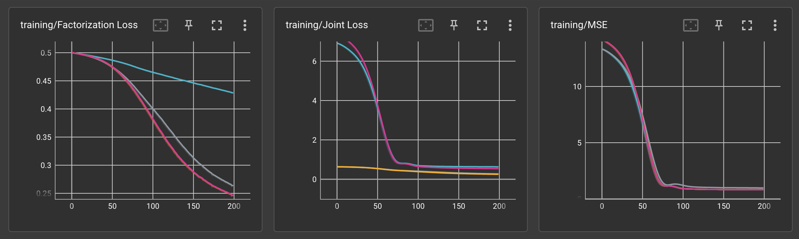
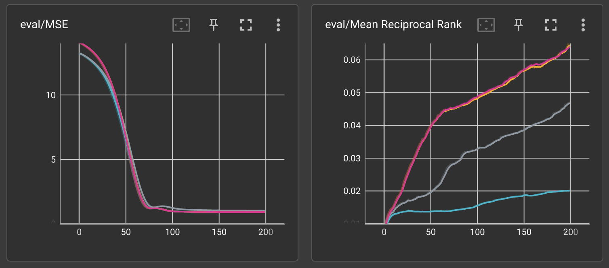

# multitask-training-evaluation
 A multitask training experiment that evaluates parameter sharing on a recommender system.

## Running
1. install all dependencies.
2. Run tensorboard to visualize experiments.
```
$ tensorboard --logdir=run
```
Alternatively, run
```
$ sh run_all.sh
```
to recreate the experiment.

## Dataset
The movielens dataset was used. More information here: https://grouplens.org/datasets/movielens/
## Experiments
Four models are compared. 
Gray: parameter sharing enabled, factorization weight = 0.99, regression weight = 0.1.
Blue: parameter sharing enabled, factorization weight = 0.5, regression weight = 0.5.
Red: parameter sharing disabled, factorization weight = 0.5, regression weight = 0.5.
Yellow: parameter sharing disabled, factorization weight = 0.99, regression weight = 0.1.
Factorization is the prediction task, 0 or 1, predicting whether the user would click on the recommendation.
Regression is the scoring task, predicting the user's rating for the recommendation.
Training metrics:

Evaluation metrics:

